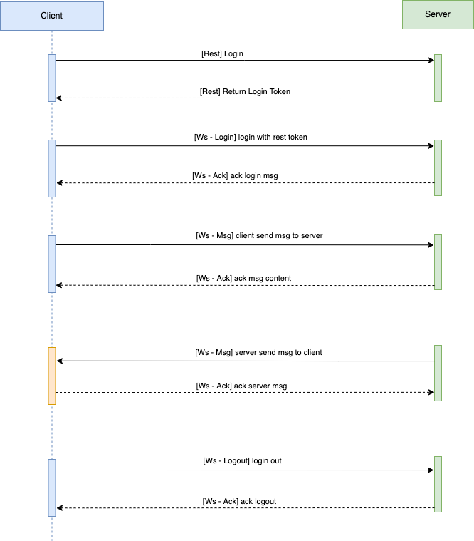

# rim

rim is an im server based on tokio-ws and rocket.

## sequence diagram



## protocol

### struct
Msg Struct
```rust
pub struct MsgEvent {
    //event: Login,Msg,Heart,Logout,Ack
    pub event: EventType,
    pub body: MsgBody,
}
```

MsgBody
```rust
pub struct MsgBody {
    //message type: Text,RichText,Image...
    pub kind: MessageType,
    pub uid: u64,
    pub gid: Option<u64>,
    pub content: String,
    pub client_msg_id: String,
    pub msg_id: Option<u64>,
}
```
### example
1. Login message 
```json
{
    "event": "Login",
    "body": {
        "kind": "Text",
        "content": "d5219358-f96b-4bfc-8672-d01ba95d16fa",
        "uid": 1,
        "clientMsgId": "72aebfd4aeef7634"
    }
}
```

2. Msg message
```json
{
    "event": "Msg",
    "body": {
        "kind": "Text",
        "content": "Hello World",
        "uid": 1,
        "gid": 1,
        "clientMsgId": "badc6d33aebfd40ab3cda"
    }
}
```

3. Logout message
```json
{
    "event": "Logout",
    "body": {
        "kind": "Text",
        "content": "", //empty string
        "uid": 1,
        "clientMsgId": "72aebfd4aeef7634"
    }
}
```